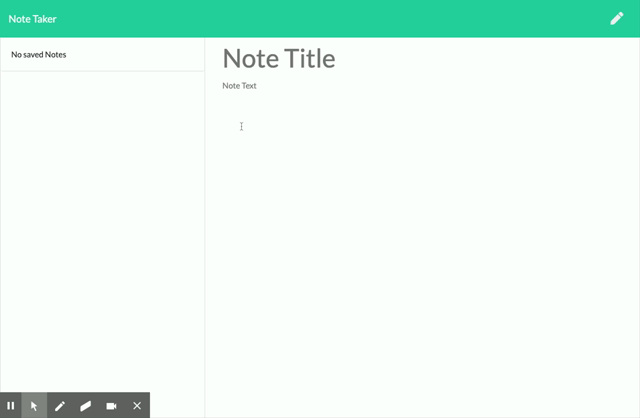

# Note Taker
## An application using Express and Node to record notes via a web application

The function of this application is to give the user a way to take notes and save them with a web application. 

The application uses express to save the notes to the server. The application uses apiroutes, json, and html to record the users notes and save them. When a user returns, the notes have been saved and they can then delete them, or add to them. 

The git repo is located here [github](https://github.com/pmhagwood/notetaker)
The server application on heroku is located here  [heroku](https://note-taker-paul.herokuapp.com/)

## Application Preview

